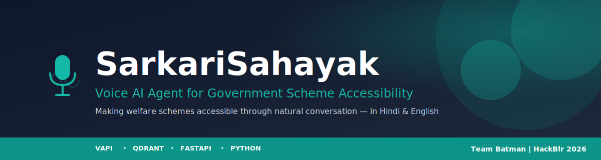
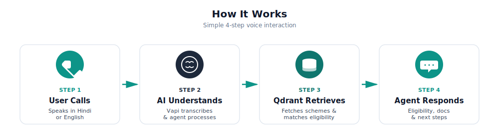
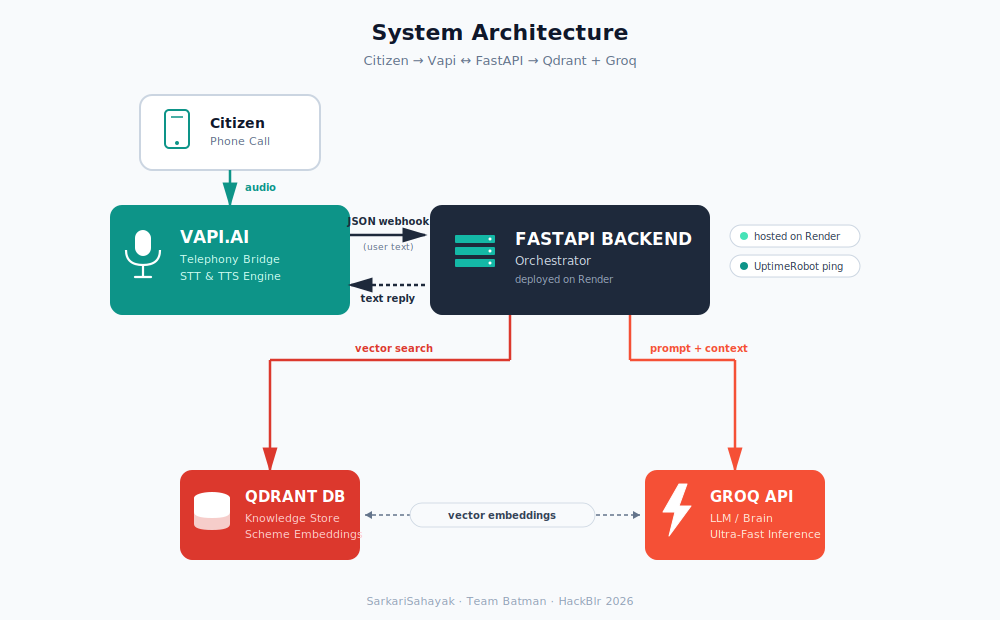

<p align="center">
  
</p>

<p align="center">
  <a href="#"></a>
  <a href="https://vapi.ai"></a>
  <a href="https://qdrant.tech"></a>
  <a href="https://fastapi.tiangolo.com"></a>
  <a href="https://groq.com/"></a>
  <a href="https://www.python.org"></a>
  <a href="#-license"></a>
</p>

---

## 📖 About

**SarkariSahayak** (सरकारी सहायक, *"Government Helper"*) is a voice-first AI agent that helps Indian citizens discover, understand, and apply for government welfare schemes through natural conversation. No app, no typing, no internet literacy required.

Just call a number, speak naturally in Hindi or English, and the agent will:

- ✅ Check your **eligibility** across multiple schemes based on your profile
- 📄 Explain the **documents** you'll need to apply
- 🧭 Guide you through the **application** process

### 🎯 The Problem We Solve

- **53%** of India's salaried workforce lacks social security benefits
- **652 million** Indians are still offline (44.7% of the population)
- Only **25%** of rural India is digitally literate
- **700+** welfare schemes exist, but most eligible citizens never access them

Literacy, language, and digital barriers prevent millions from accessing benefits they deserve. SarkariSahayak bridges this gap with voice, the most natural and universally accessible interface.

---

## 🎬 Demo

📞 **Try it live:** [Talk to SarkariSahayak](https://vapi.ai?demo=true&shareKey=ef81dd68-8514-448d-bcf7-608ce022edb6&assistantId=8b91da34-242e-4ecb-8342-92fd31e68f4f)

---

## ✨ Features

- 🎤 **Voice-First Interaction** with natural conversation, no typing required
- 🌐 **Bilingual Support** with seamless Hindi & English code-switching (regional languages coming soon)
- ✅ **Real-time Eligibility Checking** with context-aware assessment across schemes
- 📄 **Document Requirement Guidance** with a clear list of documents needed per scheme
- 🧠 **Qdrant-Powered Smart Retrieval** using semantic search to match user profiles to eligible schemes
- ⚡ **Ultra-Low Latency** powered by Groq for instant conversational reasoning
- 🔄 **Scalable Architecture** to add new schemes without retraining models

---

## 🔄 How It Works

<p align="center">
  
</p>

1. **User Calls.** The user dials the SarkariSahayak number and speaks naturally in Hindi or English.
2. **AI Understands.** Vapi transcribes the speech in real-time and passes the query to our FastAPI backend.
3. **Qdrant Retrieves.** The backend queries Qdrant, which uses vector search (`all-MiniLM-L6-v2`) to find the most relevant schemes.
4. **Agent Responds.** The Groq LLM composes a helpful, concise response, Vapi converts it to speech, and the user hears a natural voice reply.

---

## 🏗️ Architecture

<p align="center">
  
</p>

**Data flow:** Voice In → Vapi (STT) → FastAPI (Logic) → Qdrant (Retrieval) + Groq (Reasoning) → FastAPI (Response) → Vapi (TTS) → Voice Out

---

## 🛠️ Tech Stack

| Layer | Technology | Purpose |
|-------|-----------|---------|
| **Voice / Telephony** | [Vapi.ai](https://vapi.ai) | Real-time STT/TTS, bilingual voice handling |
| **Intelligence** | [Qdrant Cloud](https://qdrant.tech) | Vector database for semantic scheme retrieval |
| **Backend** | [FastAPI](https://fastapi.tiangolo.com) | Python async server, routing, and orchestration |
| **LLM** | [Groq API](https://console.groq.com/) | Lightning-fast natural language generation |
| **Embeddings** | SentenceTransformers | CPU-optimized local embeddings generation |
| **Deployment** | Render + UptimeRobot | Cloud hosting with automated keep-alive polling |

---

## 🚀 Getting Started

### Prerequisites

- Python 3.11
- A [Vapi account](https://vapi.ai)
- A [Qdrant Cloud account](https://qdrant.tech)
- A [Groq API key](https://console.groq.com/)
- `cloudflared` for local webhook tunneling ([install guide](https://developers.cloudflare.com/cloudflare-one/connections/connect-networks/downloads/))

### Installation

1. **Clone the repository**
   ```bash
   git clone https://github.com/<your-username>/sarkari-sahayak.git
   cd sarkari-sahayak
   ```

2. **Create and activate a virtual environment**
   ```bash
   python -m venv venv
   source venv/bin/activate   # On Windows: venv\Scripts\activate
   ```

3. **Install dependencies**
   ```bash
   pip install -r requirements.txt
   ```

4. **Configure environment variables**

   Create a `.env` file in the project root:
   ```env
   # Vapi
   VAPI_API_KEY=your_vapi_private_key
   VAPI_PUBLIC_KEY=your_vapi_public_key

   # Qdrant
   QDRANT_URL=https://your-cluster.qdrant.io
   QDRANT_API_KEY=your_qdrant_api_key
   QDRANT_COLLECTION=schemes

   # Groq LLM
   GROQ_API_KEY=your_groq_api_key

   # App
   APP_HOST=0.0.0.0
   APP_PORT=8000
   ```

5. **Run the FastAPI server**
   ```bash
   uvicorn src.main:app --reload --port 8000
   ```
   On first startup, the scheme data from `src/data.py` is automatically embedded and loaded into your Qdrant collection.

6. **Expose your local server with Cloudflare Tunnel** (for Vapi webhooks)
   ```bash
   cloudflared tunnel --url http://localhost:8000
   ```
   Cloudflare will print a public URL like `https://<random-name>.trycloudflare.com`. Copy this URL and set it as your **Server URL** in the Vapi assistant settings.

   > 💡 **Why Cloudflare Tunnel?** Unlike ngrok, it has no session timeouts on the free tier, gives you stable HTTPS out of the box, and doesn't rate-limit your webhooks. For a permanent tunnel with a custom domain, [authenticate cloudflared](https://developers.cloudflare.com/cloudflare-one/connections/connect-networks/get-started/) with your Cloudflare account.

7. **Test a call** from the Vapi dashboard or the demo link above.

### 🌐 Production Deployment

For production, we deploy to **Render** with **UptimeRobot** pinging the `/health` endpoint every 5 minutes to prevent free-tier cold starts. This keeps the backend responsive for Vapi webhooks without requiring a paid plan.

---

## 📁 Project Structure

```
sarkari-sahayak/
├── src/
│   ├── main.py              # FastAPI server, routing, and Vapi webhook handling
│   ├── data.py              # Qdrant client, RAG logic, and scheme data
│   ├── llm.py               # Groq LLM orchestration and prompt handling
│   └── vapi.py              # Vapi integration and voice event management
├── asset/
│   ├── banner.svg           # README banner
│   ├── architecture.svg     # System architecture diagram
│   └── flow.svg             # User flow diagram
├── .env.example             # Environment variable template
├── .gitignore               # Git ignore rules (excludes .env)
├── requirements.txt         # CPU-optimized PyTorch and dependencies
├── LICENSE                  # MIT License
└── README.md                # Project documentation
```

---

## 🏛️ Schemes Covered (Demo v1)

| Scheme | Sector | Benefit |
|--------|--------|---------|
| **Ayushman Bharat** | Health | Health insurance up to ₹5 lakh |
| **National Scholarship** | Education | Financial aid for meritorious students |
| **PM Awas Yojana** | Housing | Affordable housing for EWS/LIG/MIG |
| **PM Kisan** | Agriculture | ₹6,000/year for farmer families |
| **PM Mudra Yojana** | Finance | Collateral-free loans up to ₹20L |

> 📌 These 5 schemes represent our MVP scope. See the [Roadmap](#-roadmap) for planned expansion.

---

## 🗺️ Roadmap

- [x] **v1 (Demo)** with 5 foundational schemes, Hindi + English
- [ ] **Regional Language Support** — bringing Tamil, Bengali, and Marathi to the agent _(coming soon)_
- [ ] **Scaling Language Coverage** — expanding to all 22 official Indian languages for nationwide reach
- [ ] **WhatsApp Integration** — conversational access through WhatsApp for even wider accessibility

---

## 👥 Team Batman

Built with ❤️ at **HackBlr 2026** by:

- **Aarushi Sen**
- **Bhoomika Mittal**
- **Jagrit Goel**
- **Parth Krishan Goswami**

---

## 🤝 Contributing

This is a hackathon project, but we welcome contributions. If you'd like to help extend scheme coverage, add new languages, or improve the eligibility engine:

1. Fork the repository
2. Create a feature branch (`git checkout -b feature/new-scheme`)
3. Commit your changes (`git commit -m 'Add scheme XYZ'`)
4. Push to the branch (`git push origin feature/new-scheme`)
5. Open a Pull Request

---

## 📜 License

This project is licensed under the MIT License. See the [LICENSE](LICENSE) file for details.

---

## 🙏 Acknowledgments

- **[HackBlr 2026](https://hackblr.com)** for the platform and problem statement
- **[Vapi](https://vapi.ai)** for the voice AI infrastructure
- **[Qdrant](https://qdrant.tech)** for the vector database
- **[Groq](https://groq.com/)** for blazing-fast LLM inference
- **Government of India** for the welfare schemes that inspire this work
- Every citizen who deserves access to the rights they're entitled to

---

<p align="center">
  <i>"Because every citizen deserves access to their rights."</i>
</p>
